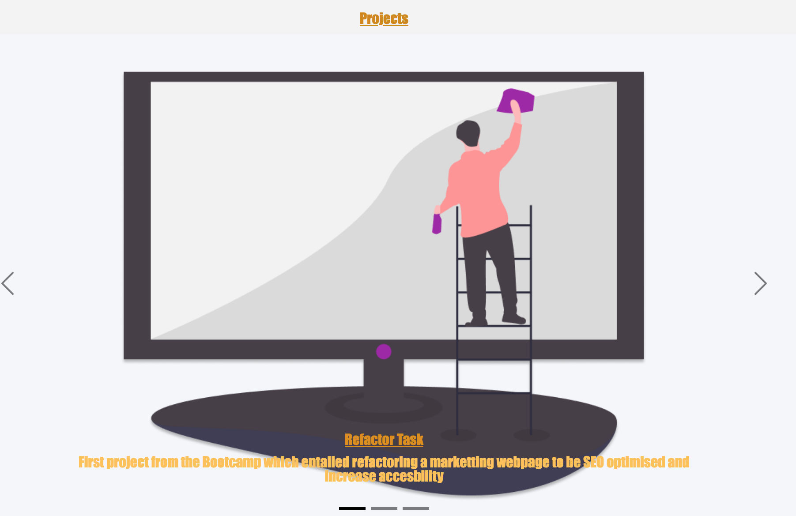

# bootstrap-portfolio
# My-Portfoolio

## Table of Contents: 
* [Installation](#installation)
* [Usage](#usage)
* [Credits](#credits)
* [License](#license)

Installation: 

Similar to the original Portfolio taks, the steps to creating the work space remain the same.

Step 1: Creating a Repo. 

// to create a repo log into the Github account and select the option to create a repo ensuring that the "add Readme file" box is ticked. 

// Once the repo was created cloning the repo on the terminal using "git clone "<SSH link>"

Step 2: creting the folders and files for the repo:

// to make a folder, in the terminal, use "mkdir (folder name i.e "assests"), in this file the CSS stylesheet will be housed as well as any assests such as images for the page. 

// to make the HTML file and the CSS file use "touch <file name>.html" and the same can be done to make a CSS style sheet but using "touch <file name>.CSS. 

Step 3: Wireframing: 

// All great designs begin as an idea, with this in mind , I spent some time thinking of how i want the page to look and how this would be best achieved, I made the wireframe usign google slides, from the previous Portfolio, some ideas were removed and some were kept to improve the presentation and uniformity of the web page through different devices, an exampleof this was removing the grid for the sections of the page and keeping them default to crete a smoother scrolling experience.

Step 3: Creating the code: 

// Since task was to create a portfolio with no previous code using bootstrap, once the idea was complete, I was tasked with completing research to understand how to create the indivdidual pieces of the page, this was done through research on Youtube as well as mdn web docs_ and using the bootstrap website to pick the items that best match the wireframe and the idea for the portfolio. 

Step 4: Creating a HTML file: 

// I began by adding the skeleton from the bootstrap website, removing all of the stock text and headings and adding my own divs and classes, in additon to this, this is where i input my own information. This meant that it would be quicker to complete the HTML page and begin woorking on the styling. In addition to this, once styling had begun, it would also be easier to see the changes made and if I like the changes or any alterations were needed.

// in additon to this creating sections within the HTML, helped to visualise each section and understand develop a better understanding where something was not working if an error occurs o rthe page is behaving in an unexpected manor. It also made it easier to read the code. 

Step 5: Creating the CSS stylesheet: 

// whilst it was possible to utilise the CSS file from the previous portfolio taks, i elected to start the CSS file from scratch to sharpen the tools, I began by using the CSS file and starting from the header and working through the page, section by section.

Usage: 

    the page will be used as my portfolio, where all of my future projects will live, in additon to this, as the my skills improve and evolve, my portfolio will also evolve to reflect my aquired skills, there is currently one project within the section as there has been one project completed on the course, therefore only one of the images is a aclickable link, as more projects are completed, the coming soon images will be replaced with links to projects. 

Credits: 

    Repo is made by myself, idea for the sliding projects as well as the nav bar and the resume section came from reviewing the bootstrap website.
    
    All ammendedments and work completed thereafter was completed independently with a lot of research and a lot more youtube videos as well as referencing lessongs from the bootcamp

License:

    See License in Repo